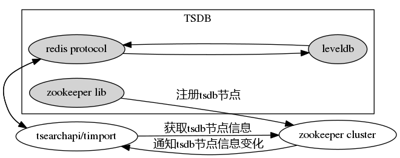

TSDB设计文档
======

#### tsdb 是一个基于时间序列的KV数据库



### 0. 特性
* 底层存储采用 [leveldb] [leveldb]，支持 snappy 压缩
* 上层传输采用 [redis 协议] [redis_protocol]，所以支持 redis 的所有客户端程序，只是有的命令不支持
* 元数据在 [zookeeper] [zookeeper] 中保存

### 1. 功能说明
  * **get key**: 返回 key 所关联的字符串值
  * **set key value**: 将字符串值 value 关联到 key ；
  * **mset key1 val1 [key2 val2...]**: 将字符串值 val1 关联到 key1，val2关联到key2...；
  * **lrange prefix_key ts1 ts2**: 返回key1=prefix_key+ts1 到 key2=prefix_key+ts2 范围内所有的KV对；
  * **keys str**: 返回数据库中所有以str开始的key（即前缀匹配）； 
  * **info**: 返回关于 TSDB 服务器的各种信息和统计数值；
  * **ping**: 判断链接是否正常；
  * **exists key**: 判断 key 是否存在。
  * **compact**

### 2. 以单机模式（SINGLE）启动
* 在 config.json 中指定工作目录、日志目录以及日志文件名，默认为：
    "node_type": "SINGLE"
    ...
    "work_path": "./var"
* 要保证上面的目录都存在：
    mkdir ./var
    mkdir ./var/logs
* 启动 tsdb：
    ./tsdb 
* 经过上面的步骤，tsdb 已经启动了，如果需要详细配置，请看4。

### 3. 以集群模式（CLUSTER）启动：
* 在 config.json 中配置如下的字段，各字段含义见4：
```
    "node_type": "CLUSTER",
    "mode": "RW",
    "ds_id": 10086,
    "key_set": [0,1024],
    "time_range": [20120101000000, -1],
    "zk_server": "zookeeper server",
    ...
    "ip": "your ip",
    "w_port": 7501,
    "r_port": 7502,
    ...
    "work_path": "./var",
```

* 启动 tsdb：
    ./tsdb
* 完毕。

### 4. 配置文件说明：
* 采用json格式保存，具体参数说明：
```
    node_type：string，节点类型。SINGLE：表示以单机形式启动；CLUSTER：表示以集群形式启动；
    mode：string，节点模式。RO：只读；RW：可读可写；
    ds_id：string，data set id；
    key_set：json(integer)，key的集合范围[start_key, end_key)，主要是对(key, val)中的key对8192取模的集合；
    time_range：json(integer)，存储的数据的时间范围[start_time, end_time]，如果mode=RO，那么end_time必须是-1；
    zk_server：string，zookeeper服务器，用于存储DN的元数据；

    ip：本机ip；   
    w_port：integer，写数据的端口号；
    r_port：integer，读数据的端口号；

    work_path：string，工作目录，主要用于存放数据库文件；
    
    ldb_write_buffer_size：integer，db写的缓存大小；
    ldb_block_size：integer，db块的大小；
    ldb_cache_lru_size：integer，db lru的cache大小；
    ldb_bloom_key_size：integer，db bloomkey的数目；
    ldb_compaction_speed: integer, compact限制；

    is_slave：integer，是否有slave；
    role: string：该节点在master-slave中的角色，可以使MASTER、SLAVE；
    slave_ip：string，slave的IP；
    slave_wport：integer，slave的端口号；
```

### 5. 代码结构说明：
* 各目录描述，详细信息请参见具体代码：
```
    .
    |-- doc                     --> 相关文档
    |-- src                     --> tsdb代码所在的目录
    |-- var                     --> tsdb默认的工作目录
    `-- tools                   --> tsdb工具集

```

### 6. 客户端：
* tsdb没有自己的客户端程序，支持Redis客户端程序，下面是redis.lua的一个例子：
```lua
    local redis = require("redis")
    local conn = redis.connect("127.0.0.1", 7501)
    local ret = conn:set("usr:rk", 10)
    if not ret then
        print("set error.")
    else
        print("set-ret:", ret)

        ret = conn:get("usr:rk")
        if not ret then
            print("get error.")
        else
            print("get-ret", ret)   -- 10
        end
    end
```

### 7. leveldb修改说明：
 目前使用版本为1.18，具体修改与[ssdb][ssdb]中的leveldb一致，另增加了`leveldb_options_set_compaction_speed`接口。

[leveldb]: https://github.com/google/leveldb "leveldb"
[redis_protocol]: http://redis.io/topics/protocol "Redis Protocol specification"
[zookeeper]: http://zookeeper.apache.org "Apache Zookeeper"
[ssdb]: https://github.com/ideawu/ssdb "ssdb"
